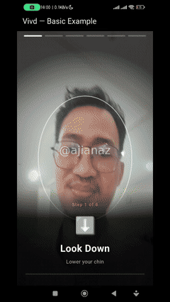

<p align="center">
  
  
  
  
</p>

<h1 align="center">Vivd</h1>

<p align="center">
  <strong>Vivid + ID</strong> — Open source Flutter face liveness SDK.<br/>
  100% on-device, offline, no API key needed. Privacy-first face verification.
</p>

<p align="center">
  
</p>

> ⚠️ **Demo di-watermark dan diberi overlay kotak untuk keamanan data pribadi.** Wajah asli tidak ditampilkan demi privasi.

---

## ✨ Features

| Feature | Description |
|---------|-------------|
| 🎯 **6 Liveness Actions** | Blink, smile, head turn left/right, look up/down |
| 📷 **Drop-in Widget** | `VivdLivenessDetector` — 3 lines to integrate |
| 🆔 **Face ID** | Face registration & identification (20 faces max) |
| 🔒 **Session Security** | HMAC-SHA256 signing, nonce replay protection |
| 📱 **Cross-Platform** | iOS (TrueDepth) and Android (front camera) |
| 📦 **Offline-First** | No server required, all processing on-device |
| 🛡️ **Anti-Spoof Stub** | Basic texture analysis (ML PAD planned for Pro) |
| 🔌 **Pluggable Detection** | `FaceDetectorInterface` — swap ML Kit, MediaPipe, etc. |

---

## 📦 Install

```bash
flutter pub add vivd
```

Or add to `pubspec.yaml`:

```yaml
dependencies:
  vivd: ^0.0.1
```

### Platform Setup

#### Android

Add camera permission to `android/app/src/main/AndroidManifest.xml`:

```xml
<uses-permission android:name="android.permission.CAMERA" />
```

**Min SDK:** 21 (Android 5.0) — configured in the plugin.

#### iOS

Add camera permission to `ios/Runner/Info.plist`:

```xml
<key>NSCameraUsageDescription</key>
<string>Camera access is required for face liveness verification.</string>
```

---

## 🚀 Quick Start

### Drop-in Widget

```dart
import 'package:vivd/vivd.dart';

VivdLivenessDetector(
  onResult: (result) {
    if (result.isLive) {
      print('Face verified! Score: ${(result.score * 100).toStringAsFixed(1)}%');
    }
  },
)
```

### Programmatic API

```dart
import 'package:vivd/vivd.dart';

final vivd = Vivd(config: VivdConfig(
  actions: [VivdAction.blink, VivdAction.smile, VivdAction.headTurnLeft],
  enableAntiSpoof: true,
  hmacKey: 'your-server-key',
));

await vivd.initialize();

final result = await vivd.startLiveness(
  frameStream: camera.frameStream,
  onProgress: (action, index, total) {
    print('Step ${index + 1}/$total: ${action.label}');
  },
);

print('Live: ${result.isLive}');
print('Score: ${result.score}');
print('Actions: ${result.passedActions}/${result.totalActions}');

await vivd.dispose();
```

### Face Identity

```dart
// Register a face
await vivd.registerFace(faceBytes, label: 'employee_001');

// Identify a face
final match = await vivd.identifyFace(faceBytes);
if (match != null) {
  print('Match: ${match.label} (${match.score})');
}

// List / remove
vivd.listFaces();
vivd.removeFace('employee_001');
```

---

## 🎮 Liveness Actions

| Action | Trigger | Est. Duration |
|--------|---------|---------------|
| 👁️ Blink | Both eyes close (< 0.3 openness) | 1000ms |
| 😊 Smile | Smile probability > 0.6 | 2000ms |
| 👈 Head Turn Left | Euler Y < -18° | 2500ms |
| 👉 Head Turn Right | Euler Y > 18° | 2500ms |
| ⬆️ Look Up | Euler X < -14° | 1500ms |
| ⬇️ Look Down | Euler X > 14° | 1500ms |

Actions are **shuffled randomly** each session (Fisher-Yates with `Random.secure`) to prevent replay attacks.

---

## 🔧 Configuration

```dart
VivdConfig(
  actions: [VivdAction.blink, VivdAction.smile],  // Default actions
  minConfirmationFrames: 3,       // Frames to confirm an action
  maxSessionDurationMs: 60000,    // Max total session time (60s)
  actionTimeoutMs: 15000,         // Timeout per action (15s)
  actionPassThreshold: 0.6,       // Min confidence to pass
  enableAntiSpoof: false,         // Enable texture analysis
  hmacKey: '',                    // Empty = no session signing
  sessionDurationSeconds: 300,    // HMAC session validity (5min)
  faceDetector: null,             // null = ML Kit default
  sensorOrientation: 270,         // Front camera portrait rotation
)
```

> **Note:** `sensorOrientation` corrects euler angle signs for front camera portrait mode. Default `270` works for most Android devices. Set to `0` or `90` for non-standard setups.

---

## 📐 API Reference

### `Vivd` — Core Facade

```dart
class Vivd {
  Vivd({VivdConfig? config});
  Future<void> initialize();
  Future<LivenessResult> startLiveness({
    required Stream<CameraFrame> frameStream,
    List<VivdAction>? actions,
    VivdProgressCallback? onProgress,
  });
  Future<FaceIdResult> registerFace(dynamic faceBytes, {required String label});
  Future<FaceIdResult?> identifyFace(dynamic faceBytes, {double threshold = 0.6});
  bool removeFace(String faceId);
  List<Map<String, dynamic>> listFaces();
  bool verifySession(String signedPayloadJson);
  Future<void> dispose();
}
```

### `VivdConfig`

| Field | Type | Default | Description |
|-------|------|---------|-------------|
| `actions` | `List<VivdAction>` | `[blink, smile]` | Actions to challenge user with |
| `minConfirmationFrames` | `int` | `3` | Frames to confirm an action |
| `maxSessionDurationMs` | `int` | `60000` | Max total session time |
| `actionTimeoutMs` | `int` | `15000` | Timeout per action |
| `actionPassThreshold` | `double` | `0.6` | Min confidence to pass |
| `enableAntiSpoof` | `bool` | `false` | Enable texture analysis |
| `hmacKey` | `String` | `''` | HMAC key (empty = no signing) |
| `sessionDurationSeconds` | `int` | `300` | HMAC session validity |
| `faceDetector` | `FaceDetectorInterface?` | `null` | Custom detector (null = ML Kit) |
| `sensorOrientation` | `int` | `270` | Camera sensor orientation (degrees) |

### `LivenessResult`

| Property | Type | Description |
|----------|------|-------------|
| `isLive` | `bool` | Whether liveness check passed |
| `score` | `double` | Confidence score (0.0 - 1.0) |
| `sessionId` | `String?` | Session ID (if HMAC enabled) |
| `actions` | `List<ActionDetail>` | Per-action breakdown |
| `antiSpoofScore` | `double?` | Anti-spoof score (if enabled) |
| `durationMs` | `int?` | Total session duration |
| `passedActions` | `int` | Number of passed actions |
| `totalActions` | `int` | Total number of actions |
| `allActionsPassed` | `bool` | Whether all actions passed |

### `VivdAction` (enum)

| Value | Label | Instruction |
|-------|-------|-------------|
| `blink` | Blink | Close both eyes |
| `smile` | Smile | Show your teeth |
| `headTurnLeft` | Turn Left | Turn head to the left |
| `headTurnRight` | Turn Right | Turn head to the right |
| `lookUp` | Look Up | Raise your chin |
| `lookDown` | Look Down | Lower your chin |

### `VivdLivenessDetector` — Drop-in Widget

```dart
VivdLivenessDetector({
  VivdConfig? config,
  void Function(LivenessResult result)? onResult,
  void Function(VivdAction action, int index, int total)? onProgress,
  CameraDescription? camera,
  ResolutionPreset? resolution,
  bool? enableAudio,
})
```

---

## 📐 Architecture

```text
lib/
├── src/
│   ├── camera/          CameraService, FrameProcessor, CameraValidator
│   ├── detection/       FaceDetectorInterface + ML Kit impl
│   ├── liveness/        LivenessEngine (action orchestration)
│   ├── identity/        FaceIdentity (registration + matching)
│   ├── security/        SessionManager (HMAC-SHA256)
│   ├── ml/              AntiSpoofEngine (texture analysis)
│   ├── models/          VivdAction, LivenessResult, FaceIdResult
│   ├── ui/              VivdLivenessDetector widget
│   └── vivd.dart        Core Vivd facade + VivdConfig
└── vivd.dart            Package entry point
```

**Detection:** Google ML Kit Face Detection — provides face landmarks (eyes, mouth, head pose) used to detect liveness actions. 100% on-device, no API key needed.

**Liveness:** Active challenge-response — user performs random actions, ML Kit landmarks are checked against thresholds. Fisher-Yates shuffled each session to prevent replay.

**Anti-spoof:** Basic texture variance analysis (Laplacian). ML PAD planned for Pro tier.

---

## 🧪 Run Example

```bash
cd example
flutter pub get
flutter run  # Requires physical device (camera)
```

---

## 📄 License

[Apache 2.0](LICENSE)

---

<p align="center">
  <sub>Built for HR attendance systems. Made with ❤️ in Indonesia.</sub>
</p>
