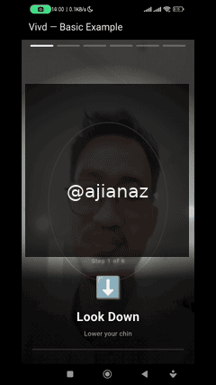

# Vivd — Basic Example

Minimal integration example for the Vivd face liveness SDK.

<p align="center">
  
</p>

> ⚠️ **Demo di-watermark dan diberi overlay kotak untuk keamanan data pribadi.** Wajah asli tidak ditampilkan demi privasi.

## Setup

1. Ensure Flutter 3.29.0+ is installed
2. Navigate to this directory:
   ```bash
   cd packages/vivd/example
   ```
3. Get dependencies:
   ```bash
   flutter pub get
   ```
4. Run on a physical device (camera required):
   ```bash
   flutter run
   ```

## What This Demonstrates

- Drop-in `VivdLivenessDetector` widget
- Explicit 6-action config (blink, smile, head turns, look up/down)
- Automatic camera initialization
- Real-time action progress
- Result display with score

## Code

```dart
// That's it — 3 lines of actual integration code:
VivdLivenessDetector(
  onResult: (result) {
    print('Live: ${result.isLive}');
  },
)
```
